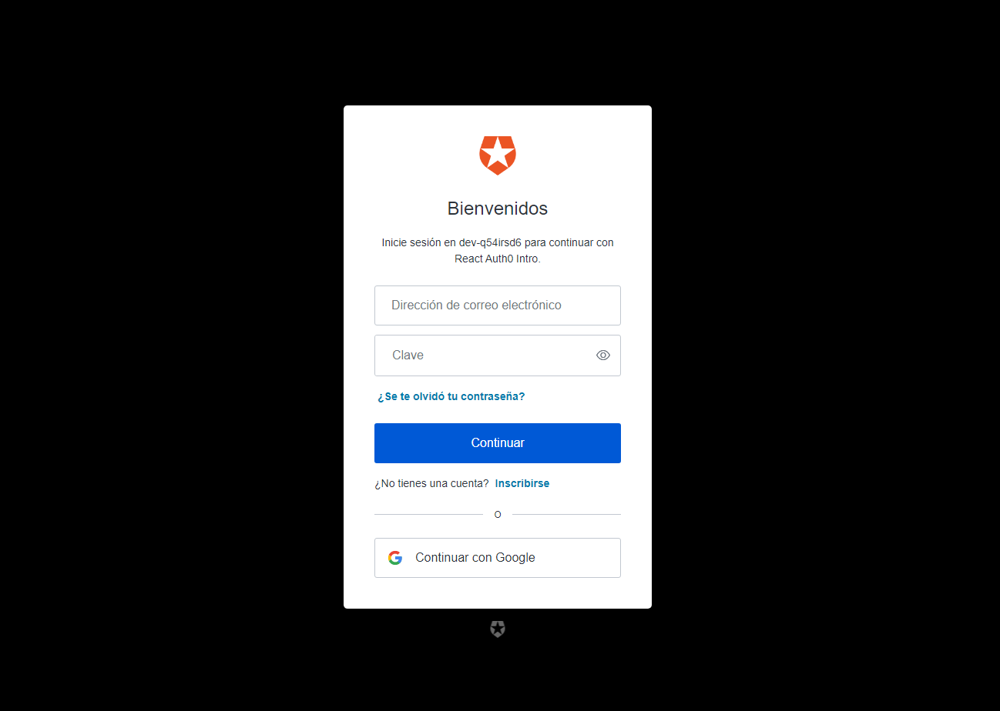

# Login en React con la librería Auth0

## Estructura

- src, es todo el código para la aplicación Backend y Frontend
- docs, carpeta de los screenshots de la aplicación

## Tutorial
- [Youtube Tutorial](https://www.youtube.com/watch?v=DRbXvN10_XA)
